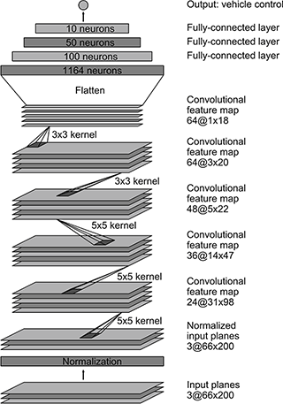
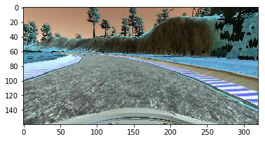
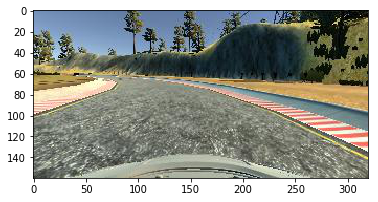
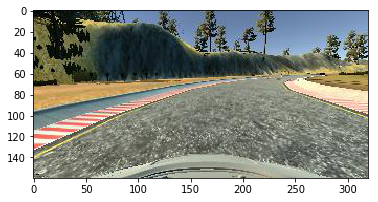
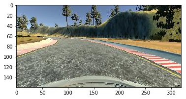
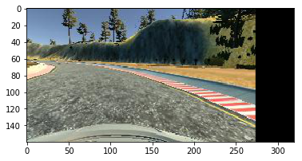
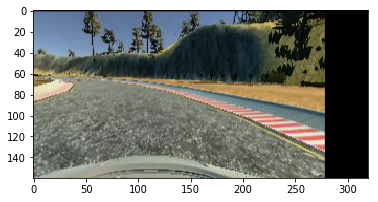
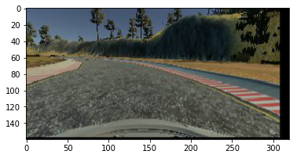
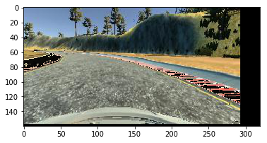
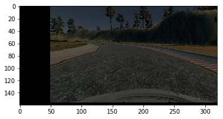

# Behaviorial Cloning Project

[](http://www.udacity.com/drive)

## Overview

This is the third project of the Udacity Selfdriving Car nanodegree.The project is about to train the car to almost go around the track. I have used modified NVIDIA architecture and different data augumentation technique to train the model.

The project has following files: 
* model.py
* drive.py
* model.h5
* video.mp4 (a video recording of your vehicle driving autonomously around the track)

## Explanation


### Model Architecture

I have inspired from NVIDIA architure and made some small changes to the architecture to use it for this project.



The main model structure is given below:

```
# Creating the model
def get_model():
    model = Sequential()
    model.add(Lambda(lambda x: x/255.-0.5,input_shape=INPUT_SHAPE))
    model.add(Cropping2D(cropping=((70, 25), (0, 0))))
    model.add(Convolution2D(24, 5, 5, border_mode="same", subsample=(2,2), activation="elu"))
    model.add(Convolution2D(36, 5, 5, border_mode="same", subsample=(2,2), activation="elu"))
    model.add(Convolution2D(48, 5, 5, border_mode="valid", subsample=(2,2), activation="elu"))
    model.add(Convolution2D(64, 3, 3, border_mode="valid", activation="elu"))
    model.add(Convolution2D(64, 3, 3, border_mode="valid", activation="elu"))
    model.add(Flatten())
    model.add(Dropout(0.5))
    model.add(Dense(100, activation="elu"))
    model.add(Dense(50, activation="elu"))
    model.add(Dense(10, activation="elu"))
    model.add(Dense(1))

    adam = Adam(lr=LEARNING_PARAMETER)
    model.compile(optimizer=adam,loss='mse')

    return model
```

The major differences are:
* Model's input image dimension is (160,320,3) compared to Nvidia model input dimension. 
* Removed one fully connected layer

### Data augumenation

I have used 5 data augumenation technique.

In order to avoid the overfitting, left and right images are randomly selected and adjusted their andle as if it was on the centre. During the autonomus testing, center image is only considered. This is the reason why if the left or right images are selected, then adjusting the steering angle. CORRECTION value is found out by trian and error method and best suited value for this model is .25.

```
# Randomly selecting the let, right, and center images
def random_select_image(data, i):
     
    random = np.random.randint(3)
    if random == 0:
        path = PATH_TO_IMG+data['left'][i].split('/')[-1]
        difference = CORRECTION
    elif random == 1:
        path = PATH_TO_IMG+data['center'][i].split('/')[-1]
        difference = 0 
    elif random == 2:
        path = PATH_TO_IMG+data['right'][i].split('/')[-1]
        difference = -CORRECTION
        
    image = cv2.imread(path)
    image = cv2.cvtColor(image, cv2.COLOR_BGR2RGB)
    angle = float(data['steer'][i])+difference
  
    return image, angle
```

One of the first technique is to convert BGR format to RGB

```
image = cv2.cvtColor(image, cv2.COLOR_BGR2RGB)
```
BGR:<br/>


RGB:<br/>



The second technique is to flip the image and change the angle. i.e if an angle is positive, flipping will change the angle to negative and vice versa.
```
# Flipping the images
def flip_img_angle(image, angle):
    image = cv2.flip(image, 1)
    angle *= -1.0
```

Actual angle: -0.3012811<br/>
Actual image:<br/>


Flipped angle: 0.3012811<br/>
Flipped image:<br/>


The tird technique used to translate the image and modify the angle accordingly. Same as any data augumentation, this can help the model to generalise so that it can handle in uncertainties.

```
# Getting trans images
def trans_image(image, steer):
    trans_range = 100
    tr_x = trans_range * np.random.uniform() - trans_range / 2
    steer_ang = steer + tr_x / trans_range * 2 * .2
    tr_y = 0
    M = np.float32([[1, 0, tr_x], [0, 1, tr_y]])
    image_tr = cv2.warpAffine(image, M, (INPUT_SHAPE[1], INPUT_SHAPE[0]))
    
    return image_tr, steer_ang
```

As per the code trans range of the image is set to 100 and steering angle is modified accordingly. 

Actual angle: -0.3012811<br/>
Before image translation:<br/>


Modified Angle: -0.6706902124449865<br/>
After image translation:<br/>



Third and final augumentation technique is brighnessed approach. In this, images are converted to random brightness. For this, modfied RGB image to HSV, scaled V (brightness) channel by a random number between .25 and 1.25, and converted the image back to RGB.

```
# Getting brightnessed image
def brightnessed_img(image):
    image = cv2.cvtColor(image, cv2.COLOR_RGB2HSV)
    random_bright = .25 + np.random.uniform()
    image[:,:,2] = image[:,:,2] * random_bright
    image = cv2.cvtColor(image, cv2.COLOR_HSV2RGB)

```
Different images with random bright:<br/>






### Model training and saving to the file

I have done 6 round of manual driving through the simulator to collect the data. I did make sure the fact that I need to get more data to generalise the track so that I even collected the data in revese track path. Simulator saved the data to a folder with csv and image from center, left, and right cameras.

I used pandas to read the csv to get the image location and steering angle.

```
# Getting data from CSV
samples = get_csv()

# Training and Validation data
training_count = int(0.8 * len(samples))
training_data = samples[:training_count].reset_index()
validation_data = samples[training_count:].reset_index()

# Get data from csv
def get_csv():
    df = pd.read_csv(PATH_TO_CSV, index_col=False)
    df.columns = ['center', 'left', 'right', 'steer', 'throttle', 'brake', 'speed']
    df = df.sample(n=len(df))

    return df
```

For getting the data for training and validation, I used ImageDataGenerator provided by Keras. The object can generate batches of tensor image data with real-time data augmentation. Even though I am using ImageDataGenerator, I didnt use any built in data augumentation technique of the method.

```
# Instantiating ImageDataGenerator other than yield function
gen_train = ImageDataGenerator(height_shift_range=0.2)
gen_valid = ImageDataGenerator()
```

ImageDataGenerator expect features and labels. I did the image preprocessing using custom get_data method and output of this function is 
features and labels for traing or validation.

```
# Getting fetatures and lables from training and validation data
def get_data(data):
    images = []
    angles = []
    for i in data.index:
        image, angle = random_select_image(data, i)

        # Data augumentation
        if np.random.uniform() < 0.5:
            image, angle = flip_img_angle(image, angle)
        image = brightnessed_img(image)
        image, angle = trans_image(image, angle)
        images.append(image)
        angles.append(angle)

    # Creating as numpy array
    X = np.array(images)
    y = np.array(angles)

    return X, y
```

Then feed them into 'flow' method ImageDataGenerator object.

```
# Getting features and labels for training and validation.
X_train, y_train = get_data(training_data)
X_valid, y_valid = get_data(validation_data)

```

Initialize the Modified Nvidia model using get_model function.

```
# Model using Keras
model = get_model()

# Creating the model
def get_model():
    model = Sequential()
    model.add(Lambda(lambda x: x/255.-0.5,input_shape=INPUT_SHAPE))
    model.add(Cropping2D(cropping=((70, 25), (0, 0))))
    model.add(Convolution2D(24, 5, 5, border_mode="same", subsample=(2,2), activation="elu"))
    model.add(Convolution2D(36, 5, 5, border_mode="same", subsample=(2,2), activation="elu"))
    model.add(Convolution2D(48, 5, 5, border_mode="valid", subsample=(2,2), activation="elu"))
    model.add(Convolution2D(64, 3, 3, border_mode="valid", activation="elu"))
    model.add(Convolution2D(64, 3, 3, border_mode="valid", activation="elu"))
    model.add(Flatten())
    model.add(Dropout(0.5))
    model.add(Dense(100, activation="elu"))
    model.add(Dense(50, activation="elu"))
    model.add(Dense(10, activation="elu"))
    model.add(Dense(1))

    adam = Adam(lr=LEARNING_PARAMETER)
    model.compile(optimizer=adam,loss='mse')

    return model
```


The keras provided fit_generator method to feed the generator function which saves the high meory usage and save the trained model to a file usind save function.

```
# Training the model
model.fit_generator(gen_train.flow(X_train, y_train, batch_size=BATCH_SIZE), samples_per_epoch= samples_per_epoch_train, validation_data=gen_valid.flow(X_valid, y_valid, batch_size=BATCH_SIZE), nb_val_samples=samples_per_epoch_valid, nb_epoch=EPOCH)
model.save('model.h5')
```

## What more can be done?

* Resizing the images
* Train the model on second track so that car can navigate on both tracks
* Play aroung with more data augumentation techniques to increase the accuracy


