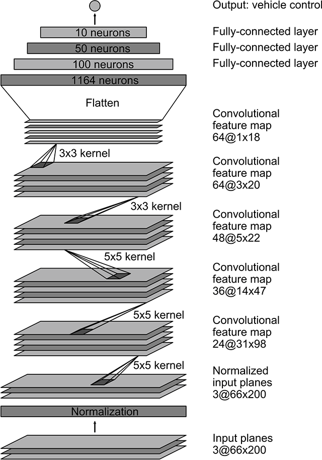

# Behaviorial Cloning Project

[](http://www.udacity.com/drive)

Overview
---

This is the third project of the Udacity Selfdriving Car nanodegree.The project is about to train the car to almost go around the track. I have used modified NVIDIA architecture and different data augumentation technique to train the model.

The project has following files: 
* model.py
* drive.py
* model.h5
* video.mp4 (a video recording of your vehicle driving autonomously around the track)


## Model Architecture

I have inspired from NVIDIA architure and made some small changes to the architecture to use it for this project.



The main model structure is given below:

```
# Creating the model
def get_model():
    model = Sequential()
    model.add(Lambda(lambda x: x/255.-0.5,input_shape=INPUT_SHAPE))
    model.add(Cropping2D(cropping=((70, 25), (0, 0))))
    model.add(Convolution2D(24, 5, 5, border_mode="same", subsample=(2,2), activation="elu"))
    model.add(Convolution2D(36, 5, 5, border_mode="same", subsample=(2,2), activation="elu"))
    model.add(Convolution2D(48, 5, 5, border_mode="valid", subsample=(2,2), activation="elu"))
    model.add(Convolution2D(64, 3, 3, border_mode="valid", activation="elu"))
    model.add(Convolution2D(64, 3, 3, border_mode="valid", activation="elu"))
    model.add(Flatten())
    model.add(Dropout(0.5))
    model.add(Dense(100, activation="elu"))
    model.add(Dense(50, activation="elu"))
    model.add(Dense(10, activation="elu"))
    model.add(Dense(1))

    adam = Adam(lr=LEARNING_PARAMETER)
    model.compile(optimizer=adam,loss='mse')

    return model
```

The major differences are:
* Model's input image dimension is (160,320,3) compared to Nvidia model dimension. 
* Removed one fully connected layer


